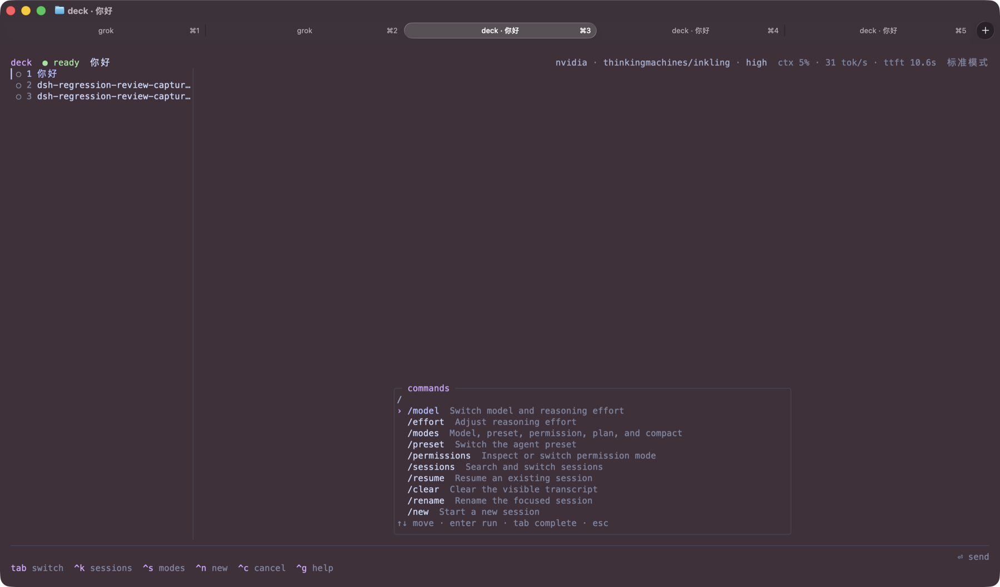

<h1>deck</h1>

[English](README.md) · **简体中文**

**在一个终端界面里管理整组编程 Agent。**

Deck 是 [DeepSeek Harness](https://github.com/deepseek-ai/deepseek-harness)
的终端原生、多会话控制台，重点适配
[Ghostty](https://ghostty.org)。它以独立进程运行：连接现有的 `dsh web`
Host，或者自动启动一个 Host，然后在同一屏幕里显示所有会话、实时输出、工具调用、
审批、提问、模型和运行模式。

Deck 不替代 DeepSeek Harness，也不自行管理模型密钥。Harness 负责 Agent、工具、
权限和模型请求；Deck 负责提供更适合终端的操作界面。



[](https://github.com/chenghaoYang/dsh-deck/actions/workflows/ci.yml)


[](LICENSE)

## 适合什么场景

- 同时运行多个编程 Agent，并快速发现哪个会话正在工作、已经失败或等待审批。
- 不想在浏览器标签页和多个终端窗口之间反复切换。
- 希望直接在终端里切换模型、推理强度、Agent 预设、权限和 Plan 模式。
- 需要看到完整实时流，包括 reasoning、工具调用、审批、问题和 token/吞吐遥测。
- 需要始终确认当前项目；顶部会显示 `项目 / 会话标题`，同名会话不会丢失工作区语境。
- 终端能力按探测开关，不支持则静默跳过：标签/任务栏进度、桌面通知、退出时的
  prompt marks。会话里的图片用 `Ctrl+O` 以 Kitty 图形浮层打开，不会嵌进
  transcript。

如果你只使用一个 Agent，Deck 会自动折叠侧栏，并把内容限制在易读的 120 列区域；
当出现第二个会话或后台活动时，多会话侧栏会自动恢复。

## 快速安装

### 环境要求

- macOS 或 Linux。
- Node.js `>= 22.19`。
- DeepSeek Harness CLI。
- Harness 支持的模型凭据。没有凭据也可以使用仓库自带的 fake LLM 测试。

查看本机版本：

```sh
node --version
npm --version
```

### 全局安装

Deck 尚未发布到 npm，当前从 GitHub 安装：
Harness 的最新预览版发布在 `next` 标签；Deck 当前针对 `0.1.0-rc.8` 完成验证。

```sh
# 1. 安装 Agent 运行时
npm i -g @deepseek-ai/dsh@next

# 2. 安装 Deck
npm i -g github:chenghaoYang/dsh-deck

# 3. 检查安装结果
dsh --version
deck --version
```

进入项目目录后启动：

```sh
cd ~/code/my-project
deck
```

也可以显式指定工作目录：

```sh
deck --cwd ~/code/my-project
```

Deck 会先尝试连接 `http://127.0.0.1:3080`。如果该端口没有可用 Host，Deck
会自动在目标目录启动 `dsh web`，退出 Deck 时再停止由它启动的 Host。

如果 Deck 打印日志路径后退出，请先查看该日志。Harness rc.8 不允许项目 `.env`
设置 `NO_PROXY`、`SSL_CERT_FILE` 等启动变量；真正的启动变量应从 shell 导出，
客户端证书则应使用项目工具约定的专用变量。

### 从源码安装并使用 linking

适合开发 Deck 或立即使用本地修改：

```sh
git clone https://github.com/chenghaoYang/dsh-deck.git
cd dsh-deck
npm install
npm run build
npm link

deck --version
```

之后 `deck` 会直接指向这个本地仓库。修改源码并重新运行 `npm run build` 即可更新
全局命令。

### 让裸 `dsh` 直接打开 Deck

把下面内容加入 `~/.zshrc`：

```sh
dsh() {
  if (( $# == 0 )); then
    command deck
  else
    command dsh "$@"
  fi
}
```

重新打开终端，或者运行：

```sh
source ~/.zshrc
```

此后：

- `dsh` 打开 Deck。
- `dsh web`、`dsh plugin` 等带参数命令仍交给官方 Harness CLI。
- `command dsh` 可以随时绕过函数，直接调用官方 CLI。

### 更新或卸载

```sh
# 更新 GitHub 版本
npm i -g github:chenghaoYang/dsh-deck

# 卸载
npm uninstall -g dsh-deck
```

## 模型与 API 配置

模型和密钥由 DeepSeek Harness 管理，Deck 只读取 Host 公布的模型目录。

### 临时环境变量

```sh
export NVIDIA_API_KEY='nvapi-…'
deck
```

进程环境变量优先级最高，适合单次覆盖。

### 持久化凭据

默认凭据文件是 `~/.dsh/.credentials.yaml`。如果设置了 `DSH_HOME`，则路径是
`$DSH_HOME/.credentials.yaml`。

```yaml
NVIDIA_API_KEY: nvapi-…
```

不要覆盖文件中已有的其他 provider 密钥。保存后设置权限：

```sh
chmod 600 "${DSH_HOME:-$HOME/.dsh}/.credentials.yaml"
```

### 配置 OpenAI-compatible Provider

默认配置文件是 `~/.dsh/settings.yaml`，或 `$DSH_HOME/settings.yaml`：

```yaml
llm-pi-ai:
  providers:
    nvidia:
      displayName: NVIDIA NIM
      apiKeyEnv: NVIDIA_API_KEY
      api: openai-completions
      baseURL: https://integrate.api.nvidia.com/v1
      compat:
        thinkingFormat: deepseek
        supportsDeveloperRole: false
        maxTokensField: max_tokens
      models:
        - id: thinkingmachines/inkling
          name: Inkling
          contextWindow: 262144
          maxTokens: 32768
          reasoningEfforts:
            low: low
            medium: medium
            high: high
          compat:
            supportsReasoningEffort: true
        - id: openai/gpt-oss-120b
          name: GPT-OSS 120B
          contextWindow: 131072
          maxTokens: 8192

agent-default-model:
  provider: nvidia
  model: thinkingmachines/inkling
  reasoningEffort: high
```

显式填写 `contextWindow` 和 `maxTokens` 很重要。很多 OpenAI-compatible 网关无法接受
Harness 内置路由的大默认输出上限。

启动 Deck 后按 `Ctrl+S` 或输入 `/model`，即可在 Host 公布的模型和 reasoning
effort 之间切换。支持 reasoning effort 的模型采用两步选择：先选模型，再选强度并按
Return 应用；界面会明确显示 `step 1/2` 和 `step 2/2`。

## 基本使用

```sh
deck
deck --attach http://127.0.0.1:3080
deck --port 3099 --cwd ~/code/my-project
deck --no-spawn
deck --help
```

| 参数 | 说明 |
|---|---|
| `--attach <url>` | 连接已经运行的 Host；连接失败时不自动启动。 |
| `--port <n>` | 修改探测和自动启动 Host 使用的端口。 |
| `--cwd <dir>` | 指定新会话的工作目录。 |
| `--no-spawn` | 没有 Host 时直接报错，不自动启动。 |
| `--no-print` | 退出时不把紧凑 transcript 写回主屏幕。 |

## Slash 命令

在输入框键入 `/` 会打开命令菜单。上下键移动，`Tab` 补全，`Enter` 执行，
`Esc` 返回输入框。

Deck 自带的终端操作包括：

```text
/model       切换模型和推理强度
/effort      调整推理强度
/modes       打开全部会话模式
/preset      切换 Agent 预设
/permissions 查看或切换权限
/sessions    打开会话管理器
/resume      恢复已有会话
/archive     打开会话管理器并归档会话
/new         新建会话
/clear       清空本地 transcript 视图
/rename      重命名当前会话
/fork        Fork 当前会话
/rewind      从某一轮用户消息 fork（Esc Esc）
/cancel      中断当前运行中的回合
/interrupt   /cancel 的别名
/dashboard   驾驶舱：窥看、回复、派发、搜索、固定、重命名（Ctrl+\\）
/queue       可视化编辑 / 删除 / 提升 pending 消息
/dequeue     删除一条 pending 消息
/steer-queued 把 queued 消息提升为 steering
/doctor      检查终端、Host、剪贴板和 OSC 能力；`/doctor fix` 做进程内修复
/vim-mode    composer vim（i/a/h/l）；Esc Esc 停到 transcript（j/k g/G）
/status      查看项目、会话、模型、权限和 Plan 状态
/context     查看 context window 与 token 构成
/cost        查看 token 与 cache 用量
/tokens      /cost 的别名
/search      搜索持久化会话内容；服务端不可用时退回本地过滤
/skills      查看当前会话可用的技能
/agents      查看当前会话的 subagent
/interrupt-agent 中断 continuable subagent
/workspaces  查看 dsh workspace
/help        打开帮助
/exit        退出 Deck（`/q` 同义）
```

菜单还会动态合并当前 Host 注册的命令。标准 Host 通常包含 `/compact`、`/export`、
`/feedback`、`/goal`、`/permission` 和 `/plan`；可选插件注册的命令也会自动出现。

带参数命令会先补全回输入框。例如选择 `/plan`，输入 `off` 后按 Enter，Deck 会通过
`commands/execute` 执行 `/plan off`，不会把它误发给模型。

这些常用功能都连接真实 Host API，而不是只显示菜单：`/cancel` 调用
`session.cancel`；queue 操作调用 `session.updateQueue`；skills、subagents、workspace
分别使用对应的 scoped API。Continuable subagent 可以继续发送和中断，one-shot
subagent 完成后保持只读。每个 session 还会独立保存输入草稿，切换会话不会把 A 的
prompt 误发给 B。

## 会话管理

按 `Ctrl+K` 打开 session manager：

常驻左栏只显示当前项目的会话，避免把不同仓库混在一起；`Ctrl+K` 仍会显示所有项目，
用于跨工作区切换。`Ctrl+N` 创建后会立即聚焦新会话，不等待 Host 下一帧列表更新。

- 直接输入文字过滤标题或工作目录。
- `Enter` 切换到选中会话。
- 搜索框为空时，Mac Delete（Backspace）、Forward Delete 或 `Ctrl+D`
  打开归档确认页；再次按 Enter 才归档。
- `Ctrl+R` 重命名。
- `Ctrl+N` 新建会话。
- `Esc` 返回。

归档只会从 Deck 隐藏会话，conversation log 会继续保存在磁盘。归档当前会话后，
Deck 会自动切换到下一个会话；没有其他会话时会创建一个新会话。

## 常用快捷键

| 快捷键 | 功能 |
|---|---|
| `/` | 打开实时命令菜单。 |
| `Enter` | 发送；Agent 忙碌时排队。 |
| `Shift+Enter` | 在输入框插入换行。 |
| `Option+Return` / `Alt+Enter` | 在下一个 step 边界注入 steering；不会取消当前回合。 |
| `Tab` | 切换到下一个会话。 |
| `Alt+1`…`Alt+9` | 跳转到指定会话。 |
| `Ctrl+K` | 会话管理器。 |
| `Ctrl+\` | 驾驶舱：窥看、回复、派发；`Ctrl+/` 搜索、`Ctrl+T` 固定、`Ctrl+G` 分组、`Ctrl+R` 重命名、`Ctrl+X` 停止/归档。 |
| `Ctrl+S` | 模型、预设、权限和 Plan 模式面板。`/compact` 只在 slash 命令中。 |
| `Ctrl+P` | 模型和推理强度选择器。 |
| `Ctrl+N` | 新建会话。 |
| `Ctrl+F` | Fork 当前会话。 |
| `Esc Esc` | Rewind：从某一轮用户消息 fork。 |
| `Ctrl+R` | 展开或折叠推理过程。 |
| `Ctrl+C` | 取消运行中的回合；空闲时退出。 |
| `Ctrl+D` | 退出；在 session manager 中打开归档确认。 |
| Mac Delete / Backspace | session manager 搜索框为空时打开归档确认；有搜索文字时删除字符。 |
| `Ctrl+G` | 帮助。 |
| `Ctrl+Y` | 复制最后一条回答。 |
| `Ctrl+E` / Ghostty 映射为 `Ctrl+E` 时的 `Cmd+Right` | 移到输入末尾。 |
| `Ctrl+X` | 展开或折叠工具详情。 |
| `Option+B` / `Option+F` | 向左/向右移动一个单词。 |
| `Ctrl+T` | 开关鼠标捕获。关闭后走终端原生选择。 |
| `Ctrl+O` | 用 Kitty 图形浮层打开最近一张图片，而不是嵌在 transcript 里。 |
| `/doctor` | 检查终端、Host、剪贴板和 OSC 能力。`/doctor fix`（或面板里按 `f`）做进程内修复：重新打开鼠标捕获、补齐已知终端的能力开关。不会改写 shell rc，也不会升级 Node。 |
| `/vim-mode` | composer vim：`i`/`a` 插入，`h`/`l`/`w`/`b`/`x` 移动/删除；Esc 进入 NORMAL，再 Esc 停到 transcript（`j`/`k` `g`/`G`）。 |
| `/queue` | 可视化编辑、删除或提升 pending 消息。 |

Agent 请求审批时，审批会抢占普通面板：`A`/`Y`/Enter 允许一次，
`R`/`N`/Esc 拒绝。后台会话需要审批时，侧栏和桌面通知都会提示。

### macOS / Ghostty 键盘说明

在 Ghostty 配置中启用：

```ini
macos-option-as-alt = true
```

这样 Option+Return、Option+B/F 等组合才能发送给 Deck。Ghostty 默认把
Command+Return 用于全屏切换，因此 Deck 收不到这个组合键。若你的 Ghostty 已将
Command+Right 映射为 `Ctrl+E`、Command+Backspace 映射为 `Ctrl+U`，Deck 会分别执行
“移动到输入末尾”和“清空输入”。Mac 的 Forward Delete 是 `Fn+Delete`。

打开普通面板时，`Ctrl+C` 会先关闭面板；再次按下才会取消运行中的回合，空闲时退出。

鼠标捕获默认开启：点击侧栏切换会话，滚轮滚动 transcript，拖选文本会在松开时
复制（系统剪贴板和 OSC 52）。Shift+拖选会被 Deck 忽略，以便在模拟器不把
Shift+点击交给应用时仍使用终端原生选择；`Ctrl+T` 可完全关闭鼠标捕获。

## 无 API Key 体验

fake LLM 只包含在源码仓库中：

```sh
npm run fake-llm -- --port 4310
DEEPSEEK_BASE_URL=http://127.0.0.1:4310 DEEPSEEK_API_KEY=fake \
  dsh web --no-open --port 3080
deck
```

可以输入 `tools`、`slow`、`long` 或 `error` 测试工具调用、流式输出、滚动和错误界面。

## 开发与验证

```sh
npm install
npm run typecheck
npm test
npm run build
npm run e2e
```

查看不需要真实终端的静态布局：

```sh
npm run preview
npm run preview -- --plain --width 100 --height 28
```

连接真实 Host 做 PTY 验证：

```sh
npm run verify -- --attach http://127.0.0.1:3080
npm run verify -- --attach http://127.0.0.1:3080 --built
```

当前测试包括单元测试、隔离的协议 E2E，以及真实 PTY/模型验证。

## 工作原理

Deck 不作为插件安装进 Harness profile。它通过与官方 Web UI 相同的 Host API 工作：

- `POST /api/<method>`：普通 RPC。
- `ws://…/api/events.mux`：会话事件、工具、审批和问题。
- `ws://…/api/events.host`：会话列表和运行状态。
- `POST /api/respond`：回答审批和 Agent 问题。

这种独立进程设计不会修改或“装坏”现有的 Harness profile，也允许 Deck、Web UI 和其他
客户端连接同一个 Host。

运行时依赖为零。Deck 使用 Node 自带的 `fetch`、`WebSocket`、`Intl.Segmenter`
和 ANSI/OSC/Kitty 协议实现终端界面。

## 与其他项目

Deck 的形态借鉴了 [waku](https://github.com/egoist/waku)：把每个 coding agent
当成同一座舱后的 driver。Waku 从 0.0.13 起已经有 DeepSeek Harness driver
（`driver/deepseek.rs`）。如果你要在桌面端同时管多种 harness，继续用 Waku。
Deck 不替代 Waku；它的差别是终端原生、作为未修改的 `dsh web` Host 的进程外
客户端，并使用 Ghostty OSC。

进程内 TUI 会作为 bundle 装进 Harness profile，组合不当可能无法启动。Deck
从不挂进 profile，只通过 HTTP 和 WebSocket 与 Host 通信，因此可以和 Web UI
或其他客户端并列连接同一个 Host。

## 当前状态

Deck 仍处于早期阶段，Host wire contract 目前针对 `dsh 0.1.0-rc.8` 实机验证。
DeepSeek Harness 本身仍是 developer preview，升级 Harness 时建议同时重新运行 Deck
的 E2E 和 PTY 验证。

欢迎提交 issue 和 PR，特别是 Ghostty 之外终端的兼容性反馈。

## License

[MIT](LICENSE)
